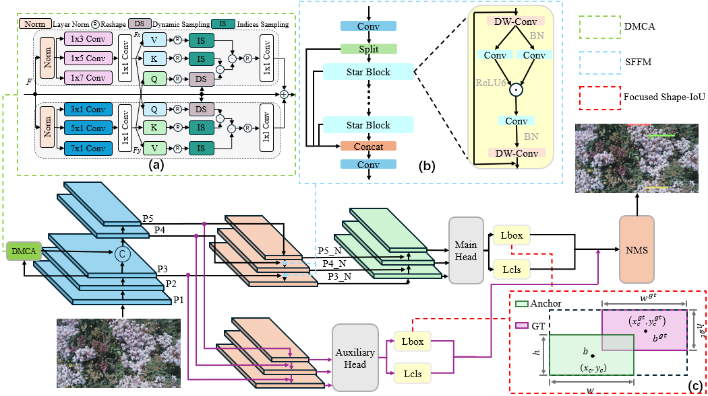

# InsectDet
[](https://doi.org/10.5281/zenodo.17385976)

Detecting and classifying tiny objects in cluttered scenes is critical for industrial development and ecosystem monitoring applications. However, this task is highly challenging due to the limitations of these objects. They have weak textural features, low contrast against backgrounds, and frequent occlusions. These factors hinder accurate identification and classification. To address these issues, we propose a robust deep network that incorporates a Dynamic Multi-scale Cross-Attention (DMCA) module, a Star Feature Fusion Module (SFFM), and a shape-sensitive Intersection over Union (IoU) loss function. The DMCA module enhances feature interaction across local and global contexts through adaptive sampling and multi-scale fusion, effectively capturing subtle characteristics of tiny objects. The SFFM improves the network's ability to integrate latent, fine-grained cues further. Additionally, we introduce a shape-sensitive IoU loss function that uses a dynamic, non-monotonic focusing mechanism to adjust gradient weights based on the quality of the bounding box. This function imposes refined penalties for discrepancies in shape and distance. Extensive experiments on two challenging small-object datasets in cluttered environments, namely, Insects-1201val and Insects-Detect, demonstrate the effectiveness of our approach.



## Dataset Download

We conduct experiments on two publicly available insect detection datasets:

- **[Insects-1201](https://zenodo.org/records/7395752)** 

- **[Insects-Detect](https://zenodo.org/records/7725941)** 

Please download the datasets from the above links and organize them according to the following structure.


## Dataset Structe
If you want to train on custom datasets you should paper dataset as following structure:
```
|-Insects1201
    |-train1201
        |-images
            |-xxx.jpg
        |-labels
            |-xxx.txt
    |-val1201
        |-images
            |-xxx.jpg
        |-labels
            |-xxx.txt
    |-test1201
        |-images
            |-xxx.jpg
        |-labels
            |-xxx.txt
```
## Training

To train the model, run this command:

```train
python train_dual.py --batch 16 --data data/insects-1201val.yaml --img 640 --cfg models/detect/yolov9-improved-s.yaml --weights '' --hyp hyp.scratch-high.yaml --epochs 100
```
## Evaluation


To evaluate pretrained model, run:

```eval
python val_dual.py --data data/insects-1201val.yaml --img 640 --batch 16 --conf 0.001 --iou 0.7 --device 0 --weights path/to/your_weights.pt --save-json
```


